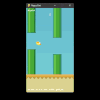

# ApexBird AI

A neural-network agent that learns to play a Flappy Bird-style game built with Pygame.

The project contains the game environment, PyTorch model, training loop, and playback runner. Training uses a genetic algorithm with a supervised warm start, allowing the population to begin with a basic gap-following behavior before evolution takes over.

## Demo



## How It Works

Each agent receives a 7-value representation of the current game state and chooses between two actions:

* `0` — Coast
* `1` — Flap

The neural network is a small MLP:

```text
7 inputs
   ↓
256 neurons
   ↓
128 neurons
   ↓
2 actions
```

The network is implemented in `flappy_model.py` using PyTorch.

### Training

Training starts with a supervised warm-up based on a deterministic gap-following policy. The resulting network is then used to initialize a population of agents.

Each generation:

1. Agents play until they die.
2. Agents are ranked by fitness.
3. The best agents are retained.
4. New agents are created by mutating copies of the better networks.
5. A portion of the population is replaced with fresh random agents.
6. The process repeats.

The trainer also supports headless execution and batched inference across the active population.

## Game Environment

The game runs at `288 × 512` with a fixed physics model:

* Gravity acceleration: `1`
* Flap impulse: `-9`
* Maximum vertical velocity: `10`
* Pipe speed: `-4`
* Pipe gap: `100`
* Base height: `404`
* Game FPS: `30`

The environment and renderer are shared between training and playback, so the agent is evaluated using the same game rules it was trained on.

The state supplied to the model contains:

* Bird vertical position
* Bird vertical velocity
* Distance to the next pipe
* Vertical distance from the bird to the pipe gap
* Gap position
* Gap size
* Distance from the bird to the ground

## Training

### Install

Python 3.9+ is recommended.

```bash
python -m venv .venv
```

Windows:

```powershell
.venv\Scripts\activate
```

Linux/macOS:

```bash
source .venv/bin/activate
```

Install the dependencies:

```bash
pip install -r requirements.txt
```

The project requires NumPy, Pygame, and PyTorch.

### Start Training

Headless training:

```bash
python train.py --headless --generations 50 --target-score 100
```

Training with the Pygame window:

```bash
python train.py
```

The default training configuration uses:

```text
Population:       500
Elites:            25
Immigration:       12%
Mutation rate:     12%
Mutation scale:    0.012
Warm-up samples:   30,000
Warm-up epochs:    5
```

These values can be changed through command-line arguments.

### Useful Options

```bash
python train.py --population 800 --elites 40 --mutation-rate 0.1 --mutation-scale 0.01
```

Disable the supervised warm start:

```bash
python train.py --no-warmup
```

Change the warm-up dataset:

```bash
python train.py --warmup-samples 50000 --warmup-epochs 8
```

For machines without a CUDA-enabled PyTorch installation:

```bash
python train.py --no-require-cuda
```

Training normally checks for a CUDA device unless `--no-require-cuda` is specified.

## Saved Models

When a new best agent is found, its network weights are saved as:

```text
model_<tag>_s<score>_g<generation>.pth
```

For example:

```text
model_best_s1991_g49.pth
```

The model files are ignored by Git by default:

```gitignore
model_*.pth
```

If you want to commit a trained checkpoint to the repository, remove or adjust that `.gitignore` rule.

## Run a Trained Model

Run the default checkpoint:

```bash
python run.py
```

`run.py` loads the model, creates a fresh game environment, and lets the network choose the action every frame.
To use a different checkpoint, set `APEXBIRD_MODEL`.

### Windows PowerShell

```powershell
$env:APEXBIRD_MODEL="model_best_s1991_g49.pth"
python run.py
```

### Linux/macOS

```bash
APEXBIRD_MODEL=model_best_s1991_g49.pth python run.py
```

## Repository Structure

```text
.
├── flappy_env.py          # Game physics, state extraction, collisions, rendering
├── flappy_model.py        # PyTorch neural network
├── train.py               # Warm-up and genetic training
├── run.py                 # Run a trained model
├── requirements.txt       # Python dependencies
├── rungif.gif             # Demo
├── .gitignore
├── .gitattributes
└── LICENSE
```

## Controls

During visual training:

* `S` — Save the best currently active agent
* Close the Pygame window — Stop training

## Assets

The project does not use the original Flappy Bird sprites or audio.

The bird, pipes, sky, and ground are generated directly with Pygame.

The game implements Flappy Bird-style mechanics without distributing the original game's assets, branding, or audio.
## License

See [`LICENSE`](LICENSE).
